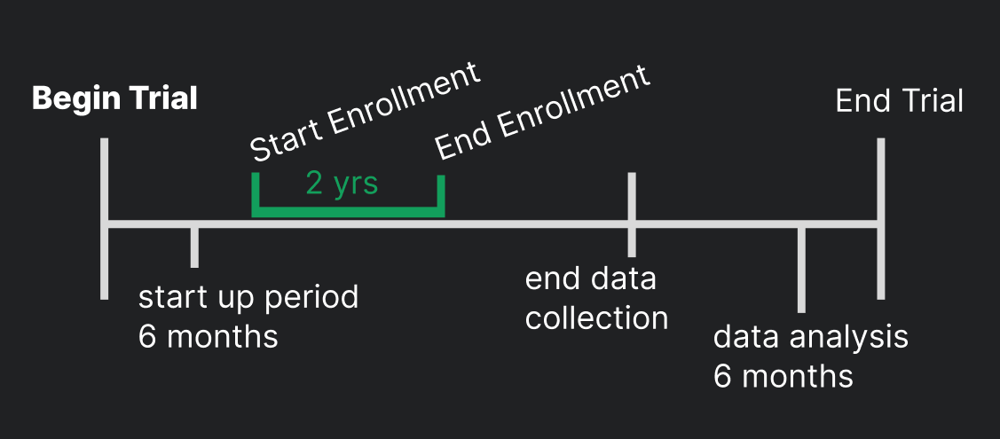

```{r setup, include=FALSE}
if (requireNamespace("thematic")) 
  thematic::thematic_rmd(font = "auto")
```

Note:
  This material is lessons from [PhD Emily C. Zabor's tutorial](https://www.emilyzabor.com/tutorials/survival_analysis_in_r_tutorial.html)


## Intro to Survival Analysis


Survival data are from _time-to-event_ data, with a `start` and `end` time.

- time from surgery to death
- time from treatment to progression

Survival analysis is used in various fields, and has various names 
[reliability, duration, event history, time-to-event] analysis

**censoring** occurs if a subject has NOT experienced the event of interest by the end of data collection

subject censoring may happen due to:

  - loss to follow-up
  - withdrawal from study
  - no event by end of study

these are _right censoring_




## Variables & Formula

The necessary variables in order to know :

- $Y_i$ observed time
- (delta_i) $\delta_i$ event indicator
- subject $i$ 

formula for observed time:

- $T_i$= event time
- $C_i$ = censoring time

$Y_i$ = min($T_i$, $C_i$)

event indicator:
```
if ( event time < censoring time)
then delta_1 = 1


if ( event time > censoring time)
then delta_1 = 0
```

The probability that a subject will survive beyond any given specified time

- $S(t)$ = survival function, conditional probability of surviving beyond that time, given that an individual has survived just prior to that time. 

Survival probability is estimated as 
`number of patients who are alive (no loss to follow-up at time)`
/
`number of patients who were alive just prior to that time`

- $F(t)$ = $Pr(T <= t)$ cumulative distribution function

$S(t)$ = $F(t)$ = $Pr(T <= t)$ = 1 - $F(t)$

In theory the survival function is smooth; in practice we observe events on a discrete time scale.


The **Kaplan-Meier** estimate of survival probability at a given time is the product of these conditional probabilities up until that given time.

at time 0, survival probability = 1 $S(t_0)$ = 1


## Packages

```{r, warning=FALSE, message=FALSE}
# install.packages(c("survival", "lubridate", "ggsurvfit", "gtsummary", "tidycmprsk"))
# remotes::install_github("zabore/condsurv")
# remotes::install_github("zabore/ezfun")

library(survival)
library(lubridate)
library(ggsurvfit)
library(gtsummary)
library(tidycmprsk)
library(condsurv)

```


## Lung Dataset

The `lung` dataset is from {survival} package.

- time: observed survival time in days
- status: censoring status, 1= censored, 2= dead
- sex: 1= male, 2= female

standard practice is to have 1= event, 0= censored

status == event

```{r}
# head(lung$status)

lung = lung %>% 
  mutate(status = dplyr::recode(status, `1` = 0, `2` = 1) )

head( lung[ , c('time','status','sex')])
```


### Survival objects & curves

The Kaplan-Meier method is the most common way to estimate survival times and probabilities. It is a non-parametric approach that results in a step function, where there is a step down each time an event occurs.


There will be one entry for each subject that is the survival time, which is followed by a `+` if the `subject was censored`. Let’s look at the first 10 observations

```{r}
Surv(lung$time, lung$status)[1:10]
```

subject 1 had an event at time 306 days
subject 2 had an event at time 455 days
subject 3 was censored at time 1010 days


The survfit() function creates survival curves using the Kaplan-Meier method based on a formula.

```{r}
surv_curv = survfit( Surv(time, status) ~ 1, data = lung)

str(surv_curv)
```

time: the timepoints at which the curve has a step, (1+ event occurred)
surv: the estimate of survival at the corresponding time


### Kaplan-Meier plots

The {ggsurvfit} package works best if you create the survfit object using the included ggsurvfit::survfit2() function, which uses the same syntax to what we saw previously with survival::survfit(). The ggsurvfit::survfit2() tracks the environment from the function call, which allows the plot to have better default values for labeling and p-value reporting.

```{r, message=FALSE, error=FALSE}
library(tidyverse)
survfit2( Surv(time, status) ~ 1, data= lung) %>% 
  ggsurvfit()+
  ggplot2::labs(
    x="Days", y="Overall survival probability"
  )+
  ggdark::dark_mode()+
  add_confidence_interval()+ 
  geom_ribbon(col='pink', alpha= 0.2)
  # add_risktable( )
```


### Estimating Survival

One quantity often of interest in a survival analysis is the probability of surviving beyond a certain number of years, x.

remember that time in this dataset is in days

```{r}
summary( survfit( Surv(time, status) ~ 1, data = lung), times = 365.25)
```

We find that the 1-year probability of survival in this study is 41%.

**caution**: ignoring censoring leads to overestimate of the survival probability


```{r}
survfit( Surv(time, status) ~ 1, data = lung) %>% 
  tbl_survfit(
    times = 365.25,
    label_header = "**1-year survival (95% CI)**"
  )
```


### Estimating median survival

Another quantity often of interest in a survival analysis is the average survival time, which we quantify using the median. Survival times are not expected to be normally distributed so the mean is not an appropriate summary.

```{r}
survfit( Surv(time, status)  ~ 1, data = lung)
```

We see the median survival time is 310 days


### Comparing survival between groups

We can conduct between-group significance tests using a log-rank test. The log-rank test equally weights observations over the entire follow-up time and is the most common way to compare survival times between groups.

```{r}
survdiff(Surv(time, status) ~ sex, data = lung)
```
We see that there was a significant difference in overall survival according to sex in the lung data, with a p-value of p = 0.001.


### Cox Regression Model

We may want to quantify an effect size for a single variable, or include more than one variable into a regression model to account for the effects of multiple variables.

The Cox regression model is a semi-parametric model that can be used to fit univariable and multivariable regression models that have survival outcomes.

$h(t)$ = hazard or instantaneous rate at which events occur
$h_0(t)$ =underlying baseline hazard


$h(t)$ = $h_0(t)$ exp($\beta_1$ * $X_i1$ + ... )


key assumptions:

- non-informative censoring
- proportional hazards 

```{r}
coxph( Surv(time, status) ~ sex, data = lung)
```

The quantity of interest from a Cox regression model is a hazard ratio (HR). The HR represents the ratio of hazards between two groups at any particular point in time. The HR is interpreted as the instantaneous rate of occurrence of the event of interest in those who are still at risk for the event. It is not a risk, though it is commonly misinterpreted as such. If you have a regression parameter β, then HR = exp(β).

`HR < 1` indicates reduced hazard of death
`HR > 1` indicates an increased hazard of death

```{r}
coxph(Surv(time, status) ~ sex, data = lung) %>% 
  tbl_regression(exp = TRUE)
```


HR = 0.59, p-value= 0.001

0.59 times as many females are dying as males at any given time
{females have a significantly lower hazard of death than males in this data}


> The analyses so far has relied on the covariate being measured at baseline, that is, before follow-up time for the event begins. Next part measures covariate after follow uo time


# Analysis & Time Dependent Covariates

Overall survival is measured from treatment start, and interest is in the association between complete response to treatment and survival.

possible covariates of interest in cancer research that may not be measured at baseline include:

- transplant failure
- graft versus host disease
- second resection
- adjuvant therapy
- compliance
- adverse events


## The BMT dataset

This section we will use the BMT dataset from {SemiCompRisks} package as an example dataset. The data consist of 137 bone marrow transplant patients. Variables of interest include:

- `T1` time (in days) to death or last follow-up
- `delta1` death indicator; 1= Dead, 0= Alive
- `TA` time (in days) to acute graft-versus-host disease
- `deltaA` acute graft-versus-host disease indicator; 
    - 1 = Developed acute graft-versus-host disease
    - 0 = Never developed acute graft-versus-host disease

```{r}
# install.packages("SemiCompRisks")
data(BMT, package = 'SemiCompRisks')

# head(BMT [ ,c('T1','delta1','TA','deltaA')] )

BMT = BMT %>% janitor::clean_names()
```


## Landmark Approach

1. Select a fixed time after baseline as your landmark time. Note: this should be done based on clinical information, prior to data inspection

2. Subset population for those followed at least until landmark time. Note: always report the number excluded due to the event of interest or censoring prior to the landmark time.

3. Calculate follow-up from landmark time and apply traditional log-rank tests or Cox regression.


In the BMT data, interest is in the association between **acute graft versus host disease (aGVHD)** and **survival**. But aGVHD is assessed after the transplant, which is our baseline, or start of follow-up, time.


### Steps

STEP 1:

Typically aGVHD occurs within the first 90 days following transplant, so we use a 90-day landmark.

STEP 2:

Subset population for those followed at least until landmark time

```{r}
# T1 is time in days
landmark_data = BMT %>%
  select(t1, delta1, delta_a, ta) %>% 
  dplyr::filter(t1 >= 90)
 # exclude patients before 90 days

```


STEP 3:

Calculate follow-up time from landmark and apply traditional methods.

```{r}
landmark_data = landmark_data %>%
  mutate( lm_T1 = t1 - 90)
```

```{r}
survfit2( Surv(lm_T1, delta1) ~ delta_a, data= landmark_data)
```

```{r}
survfit2( Surv(lm_T1, delta1) ~ delta_a, data= landmark_data) %>% 
  ggsurvfit()+
  labs(x="Days from 90 day landmark",
       y="Overall survival probability")+
  # add_risktable()+
  ggdark::dark_mode()
```

In Cox regression you can use the subset option in coxph to exclude those patients who were not followed through the landmark time, and we can view the results using the tbl_regression() function from the {gtsummary} package:

```{r}
coxph(
  Surv(t1, delta1) ~ delta_a,
  subset = t1 >= 90,
  data = BMT
) %>% 
  tbl_regression()
```


